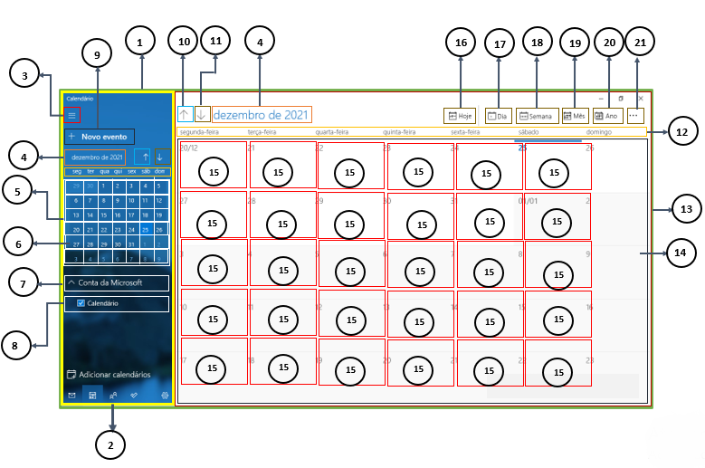

# Windows 10 React Calculator App

## The hierarchy of components

* [1. App (Encompasses the whole app)](#usage)
  * [2. AppLeftSide (Encompasses all the elements that reside on the left part of the app)](#available-scripts)
    * [3. ToggleLeftSide (shows and hides the left-side of the app)](#npm-start)
    * [4. CurrentDate (shows the current month and year)](#npm-test)
    * [5. MiniCalendar (Shows the days of the selected month, highlights the current day)](#npm-run-build)
    * [6. MiniDay (shows a particular day of a particular month)](#npm-run-eject)
    * [7. AccountSelector (Selects the current account to use with the App)](#learn-more)
    * [8. EventSelector (hides or shows registered events)](#code-splitting)
    * [9. EventCreator (creates an event)](#analyzing-the-bundle-size)
    * [10. NextMonth (goes to the next month on the calendar) ](#making-a-progressive-web-app)
    * [11. PreviousMonth (goes to the previous month on the calendar)](#advanced-configuration)
    * [12. WeekDays (shows the days of the week from monday to sunday)](#deployment)
  * [13. AppRightSide (Encompasses all the elements that reside on the right side of the app)](#npm-run-build-fails-to-minify)
    * [14. MaxCalendar (shows the days of the selected month, highlights the current day)](#google-analytics-setup)
    * [15. MaxDay (shows a particular day of a particular month)](#credits)
    * [16. TodayFilter (changes the appearence of MaxCalendar to focus on the hours of today)](#terms-and-license)
    * [17. DayFilter (changes the appearence of MaxCalendar to focus on the selected day or days)](#about-us)
    * [18. WeekFilter (changes the appearence of MaxCalendar to focus on the working or full week )](#stay-in-the-loop)
    * [19. MonthFilter (changes the appearence of MaxCalendar to focus on the days of the month - highlights the current day )](#stay-in-the-loop)
    * [20. YearFilter (changes the appearence of MaxCalendar to show all the months of the year from Jan to Dec )](#stay-in-the-loop)